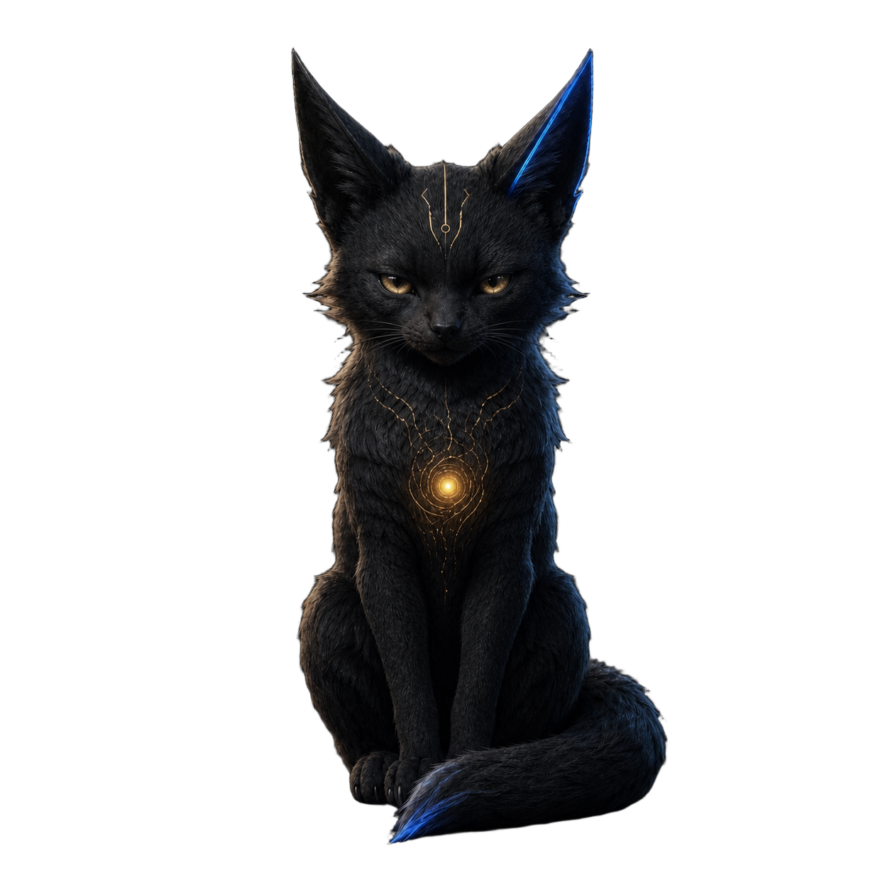
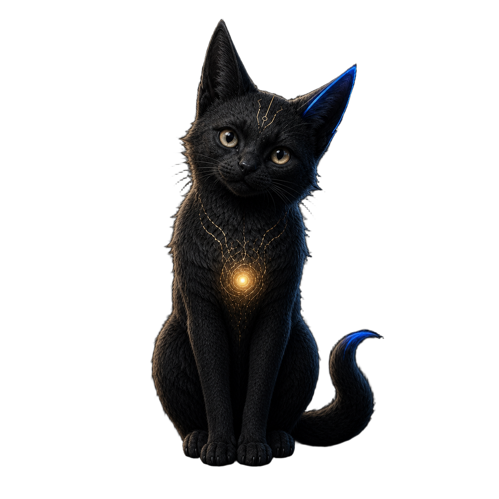
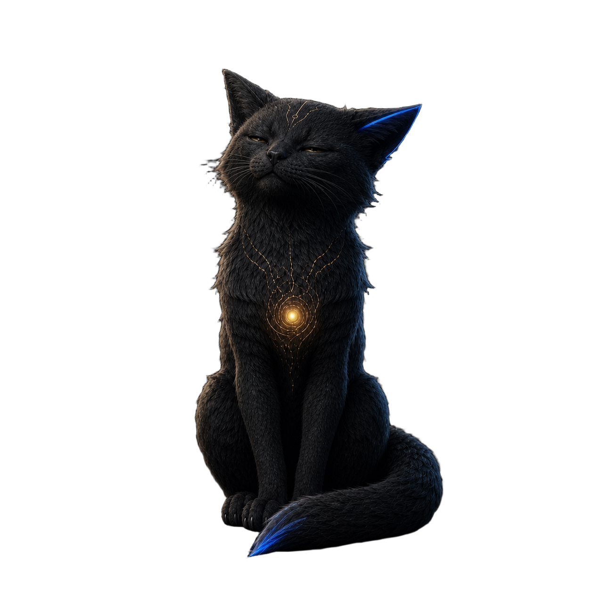
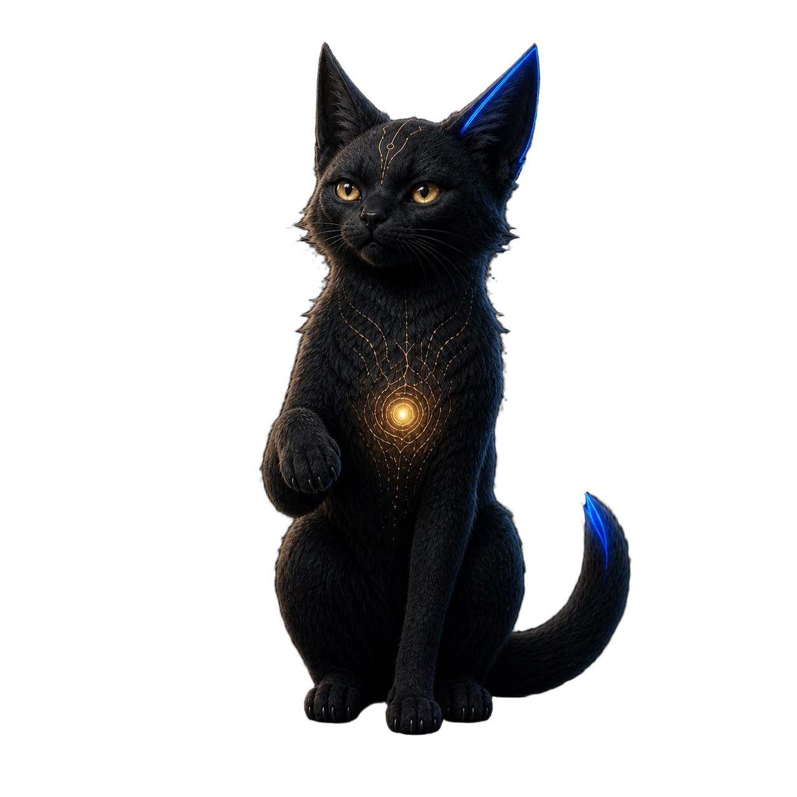
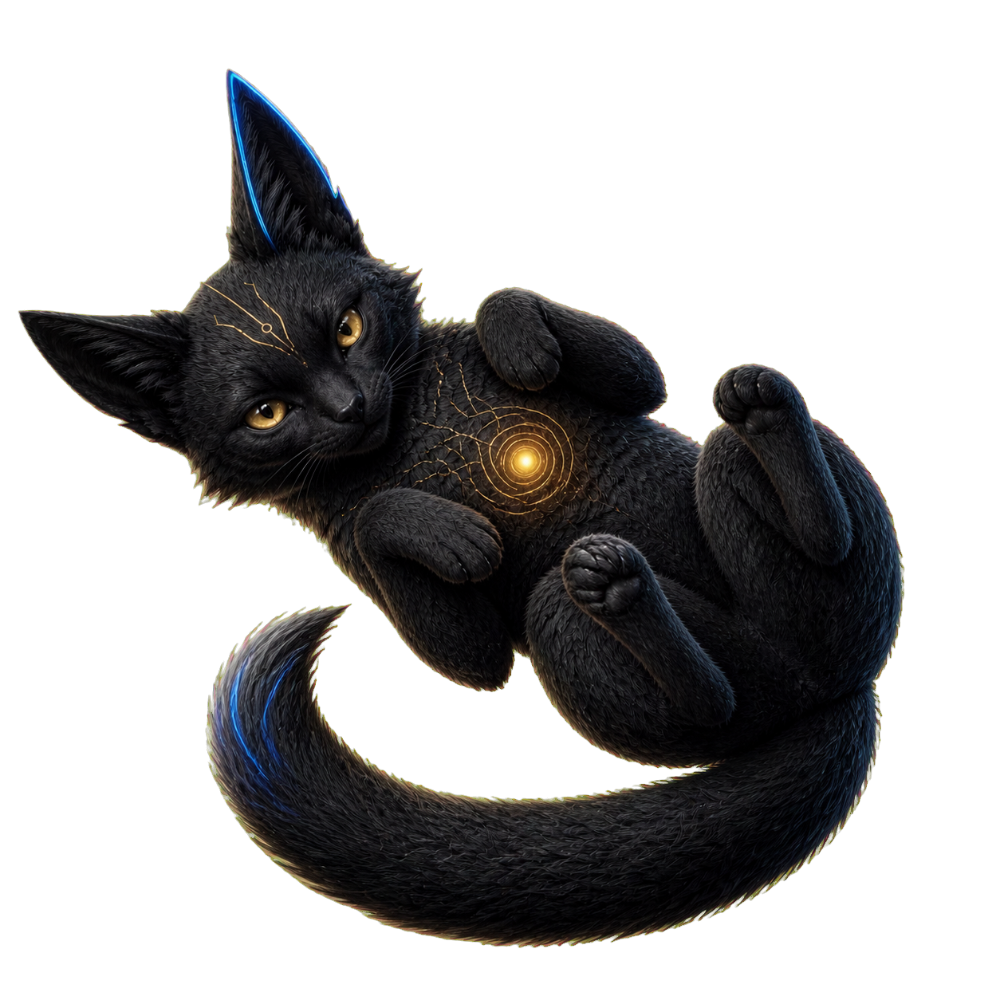
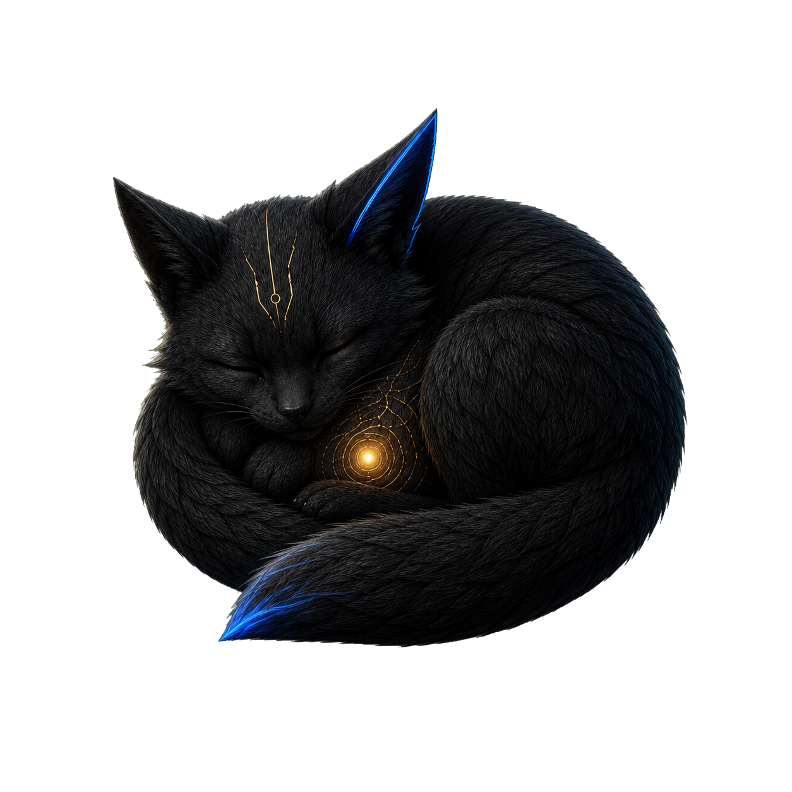

<p align="center">
  
</p>

<h1 align="center">墨核 · Mohe</h1>

<p align="center"><strong>一只守护长期工作的本地小兽。</strong></p>

<p align="center">
  <a href="README.md">English</a> · <a href="README.zh-CN.md">简体中文</a>
</p>

<p align="center">
  
  
  
  
</p>

墨核是一只安静、聪明，会守护长期工作的 Codex 宠物。

它不催你，也不占满屏幕。大多数时候，它只是安静守在旁边；你碰一碰耳朵、头顶、胸口、爪子或尾巴，它会歪头、眯眼、抬爪、打滚，或者把自己卷成一团。

献给那些愿意把一件事做很久，也值得有一只小兽守着的人。

## 两个栖息地，同一只墨核

这个仓库同时收录墨核的两个版本：

- **Codex 宠物版**：可安装的 v2 宠物包，使用 8 × 11 动画图集，包含标准状态与 16 个方向的移动行。
- **Windows 桌面版**：可以触碰、梳毛、记忆、专注和自主变换心情的完整栖息地。

## 墨核不只有一种样子

<table>
  <tr>
    <td align="center"><br /><b>守护</b><br /><sub>安静地待在身边</sub></td>
    <td align="center"><br /><b>好奇</b><br /><sub>歪头看看你在做什么</sub></td>
    <td align="center"><br /><b>享受</b><br /><sub>眯起眼睛，核心变暖</sub></td>
  </tr>
  <tr>
    <td align="center"><br /><b>警觉</b><br /><sub>抬起前爪，耳朵听见了</sub></td>
    <td align="center"><br /><b>打滚</b><br /><sub>藏不住的反差萌</sub></td>
    <td align="center"><br /><b>毛团</b><br /><sub>缩成一团，暂时不营业</sub></td>
  </tr>
</table>

## 为什么它会像一只活着的小兽

- 耳朵、头顶、胸口、前爪、尾巴和身体都有不同回应。
- 双击墨核，鼠标会变成真实比例的毛刷；右键即可收起毛刷。
- 梳毛时会保持享受、翻身或毛团姿势，继续刷才继续反馈，不会瞬间弹回原样。
- 空闲时每隔 24–40 秒随机抬头、眯眼、打滚或蜷成一团。
- 内置 25 分钟专注计时、本地记忆卡、实时动态和动作工坊。
- 不需要账号，不上传记忆，不收集使用数据。

## 安装 Codex 宠物版

在仓库根目录打开 PowerShell：

```powershell
powershell -ExecutionPolicy Bypass -File .\codex-pet\install-mohe.ps1
```

脚本会把宠物包复制到 `%USERPROFILE%\.codex\pets\mohe`。重新启动 Codex，进入「宠物」页面；如果列表没有立即更新，点一下刷新，再选择「墨核」。

## 运行 Windows 桌面版

需要 Node.js 22.12+ 与 pnpm：

```powershell
cd .\desktop-app
corepack enable
pnpm install --frozen-lockfile
pnpm build
pnpm desktop
```

可直接运行的 Windows 版本会发布在 [Releases](https://github.com/shixi-11/mohe-codex-pet/releases) 页面。

## 角色设定

墨核是一只“长期主义的本地小兽”：安静但不冷淡，聪明却不炫耀，会护住重要基线，熟悉以后还会露出淘气的反差萌。完整设定见[角色卡](docs/character-card.zh-CN.md)。

## 隐私与公开范围

- 仓库只收录应用源码、运行所需视觉资产、Codex 宠物包和公开文档。
- 生成缓存、本地模型、测试归档、绝对路径、私人记忆和设备构建目录均不会上传。
- 桌面版没有内置统计、账号系统或云端记忆服务。

## 一起把墨核养得更好

欢迎提交问题、互动点子、新动作序列、无障碍改进和其他平台适配。提交代码前请阅读 [CONTRIBUTING.md](CONTRIBUTING.md)。

## 开源许可

代码与仓库内的墨核原创资产采用 [MIT License](LICENSE) 开源。

墨核是独立的社区项目，与 OpenAI 无隶属或背书关系。
